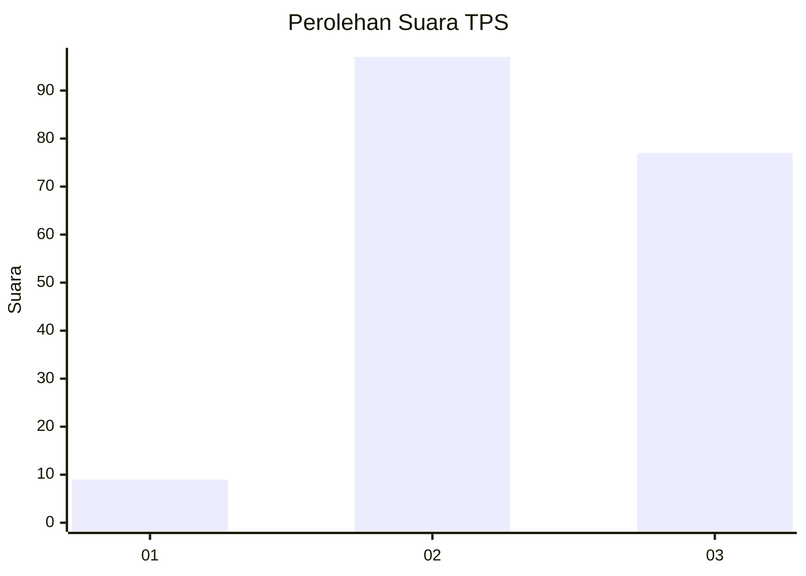
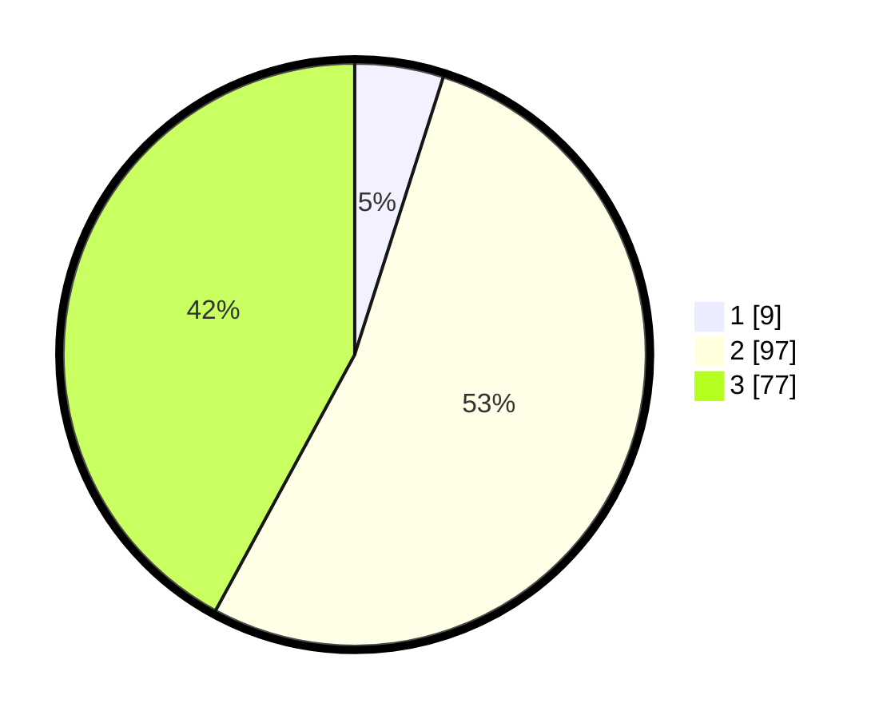

# Hasil

## Grafik

## Tabel

| No. | Nama Paslon    | Suara | Suara (raw) | Persentase |
|:--- |:-------------- | -----:| -----------:| ----------:|
| 1   | ANIES MUHAIMIN | 9     | [9][p-1]    | 4,92       |
| 2   | PRABOWO GIBRAN | 97    | [97][p-2]   | 53,01      |
| 3   | GANJAR MAHFUD  | 77    | [77][p-3]   | 42,08      |

[p-1]: https://github.com/gigit-pemilu/pemilu-2024-21-kepulauan-riau/blob/main/pilpres/hitung-suara/sub/21-kepulauan-riau/sub/72-kota-tanjung-pinang/sub/03-tanjung-pinang-kota/sub/1001-tanjung-pinang-kota/sub/003-tps/sub/paslon-1.txt
[p-2]: https://github.com/gigit-pemilu/pemilu-2024-21-kepulauan-riau/blob/main/pilpres/hitung-suara/sub/21-kepulauan-riau/sub/72-kota-tanjung-pinang/sub/03-tanjung-pinang-kota/sub/1001-tanjung-pinang-kota/sub/003-tps/sub/paslon-2.txt
[p-3]: https://github.com/gigit-pemilu/pemilu-2024-21-kepulauan-riau/blob/main/pilpres/hitung-suara/sub/21-kepulauan-riau/sub/72-kota-tanjung-pinang/sub/03-tanjung-pinang-kota/sub/1001-tanjung-pinang-kota/sub/003-tps/sub/paslon-3.txt

## Foto C Plano

https://sirekap-obj-formc.kpu.go.id/7075/pemilu/ppwp/21/72/03/10/01/2172031001003-20240218-132600--1e4955b4-b398-4e71-aa88-083215d2a262.jpg

https://sirekap-obj-formc.kpu.go.id/7075/pemilu/ppwp/21/72/03/10/01/2172031001003-20240218-132603--e9222d2a-1139-48bb-a9cb-f4ad7f018825.jpg

https://sirekap-obj-formc.kpu.go.id/7075/pemilu/ppwp/21/72/03/10/01/2172031001003-20240218-132547--16b8b5d2-8508-4e19-86c3-9907aa2199d5.jpg

## Metadata

| Key        | Value               |
| ---------- | ------------------- |
| Time Stamp | 2024-02-22 18:00:00 |

