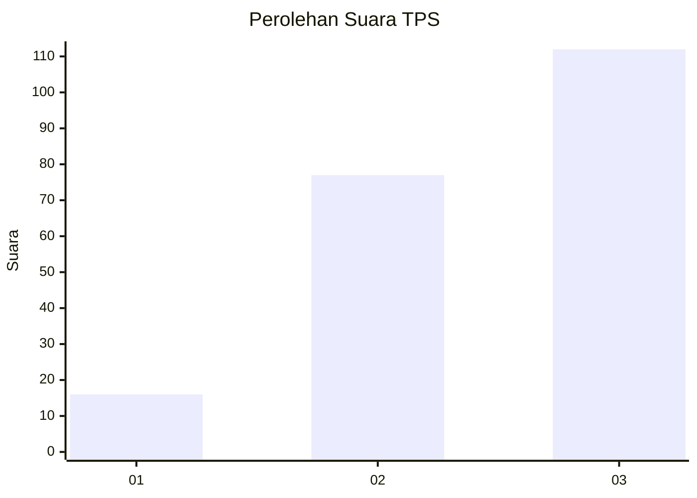
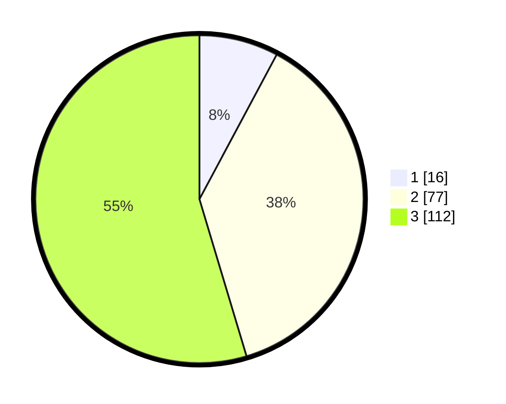

# Hasil

## Grafik

## Tabel

| No. | Nama Paslon    | Suara | Suara (raw) | Persentase |
|:--- |:-------------- | -----:| -----------:| ----------:|
| 1   | ANIES MUHAIMIN | 16    | [16][p-1]   | 7,80       |
| 2   | PRABOWO GIBRAN | 77    | [77][p-2]   | 37,56      |
| 3   | GANJAR MAHFUD  | 112   | [112][p-3]  | 54,63      |

[p-1]: https://github.com/gigit-pemilu/pemilu-2024-21-kepulauan-riau/blob/main/pilpres/hitung-suara/sub/21-kepulauan-riau/sub/72-kota-tanjung-pinang/sub/03-tanjung-pinang-kota/sub/1001-tanjung-pinang-kota/sub/004-tps/sub/paslon-1.txt
[p-2]: https://github.com/gigit-pemilu/pemilu-2024-21-kepulauan-riau/blob/main/pilpres/hitung-suara/sub/21-kepulauan-riau/sub/72-kota-tanjung-pinang/sub/03-tanjung-pinang-kota/sub/1001-tanjung-pinang-kota/sub/004-tps/sub/paslon-2.txt
[p-3]: https://github.com/gigit-pemilu/pemilu-2024-21-kepulauan-riau/blob/main/pilpres/hitung-suara/sub/21-kepulauan-riau/sub/72-kota-tanjung-pinang/sub/03-tanjung-pinang-kota/sub/1001-tanjung-pinang-kota/sub/004-tps/sub/paslon-3.txt

## Foto C Plano

https://sirekap-obj-formc.kpu.go.id/8fc3/pemilu/ppwp/21/72/03/10/01/2172031001004-20240218-143734--ae23f6e3-8a83-4471-8c67-3977ff0b8b30.jpg

https://sirekap-obj-formc.kpu.go.id/8fc3/pemilu/ppwp/21/72/03/10/01/2172031001004-20240218-143738--e9958bb1-7240-4e32-9cb9-3813123be6bc.jpg

https://sirekap-obj-formc.kpu.go.id/8fc3/pemilu/ppwp/21/72/03/10/01/2172031001004-20240218-143726--8851e698-2575-4e4a-8f16-d16be143408a.jpg

## Metadata

| Key        | Value               |
| ---------- | ------------------- |
| Time Stamp | 2024-02-22 18:00:00 |

