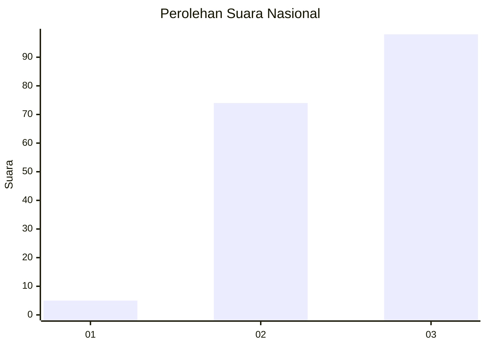
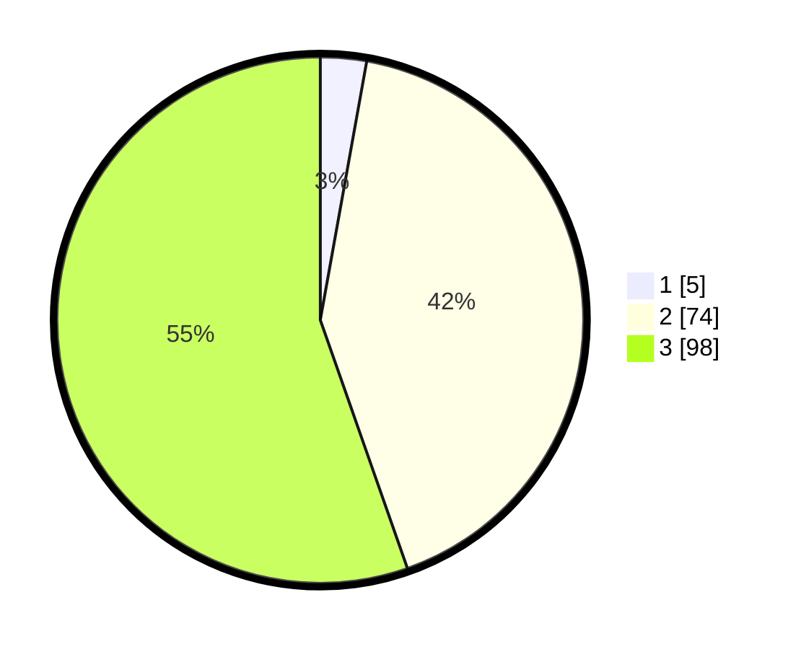

# Hasil

## Grafik

## Tabel

| No. | Nama Paslon    | Suara | Suara (raw) | Persentase |
|:--- |:-------------- | -----:| -----------:| ----------:|
| 1   | ANIES MUHAIMIN | 5     | [5][p-1]    | 2,82       |
| 2   | PRABOWO GIBRAN | 74    | [74][p-2]   | 41,81      |
| 3   | GANJAR MAHFUD  | 98    | [98][p-3]   | 55,37      |

[p-1]: https://github.com/gigit-pemilu/pemilu-2024/blob/main/pilpres/hitung-suara/sub/21-kepulauan-riau/sub/72-kota-tanjung-pinang/sub/03-tanjung-pinang-kota/sub/1001-tanjung-pinang-kota/sub/005-tps/sub/paslon-1.txt
[p-2]: https://github.com/gigit-pemilu/pemilu-2024/blob/main/pilpres/hitung-suara/sub/21-kepulauan-riau/sub/72-kota-tanjung-pinang/sub/03-tanjung-pinang-kota/sub/1001-tanjung-pinang-kota/sub/005-tps/sub/paslon-2.txt
[p-3]: https://github.com/gigit-pemilu/pemilu-2024/blob/main/pilpres/hitung-suara/sub/21-kepulauan-riau/sub/72-kota-tanjung-pinang/sub/03-tanjung-pinang-kota/sub/1001-tanjung-pinang-kota/sub/005-tps/sub/paslon-3.txt

## Foto C Plano

https://sirekap-obj-formc.kpu.go.id/ef4f/pemilu/ppwp/21/72/03/10/01/2172031001005-20240215-015100--6a12f447-643b-4ed4-afe5-d2f804d337e1.jpg

https://sirekap-obj-formc.kpu.go.id/ef4f/pemilu/ppwp/21/72/03/10/01/2172031001005-20240215-015250--2edb87aa-8810-43bc-86e8-7bba874ba117.jpg

https://sirekap-obj-formc.kpu.go.id/ef4f/pemilu/ppwp/21/72/03/10/01/2172031001005-20240215-015327--51d1640e-5a7c-436b-9d9e-3c4aadf365c0.jpg

## Metadata

| Key        | Value               |
| ---------- | ------------------- |
| Time Stamp | 2024-02-22 18:00:00 |

