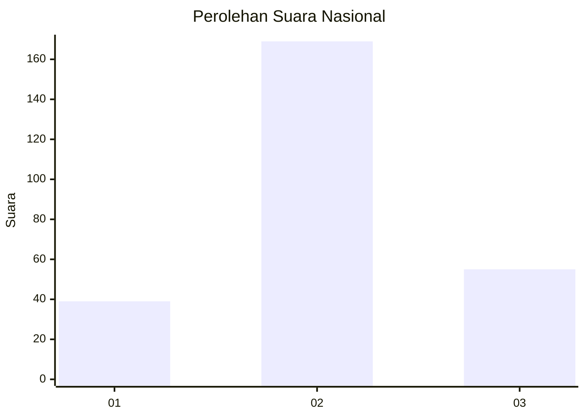
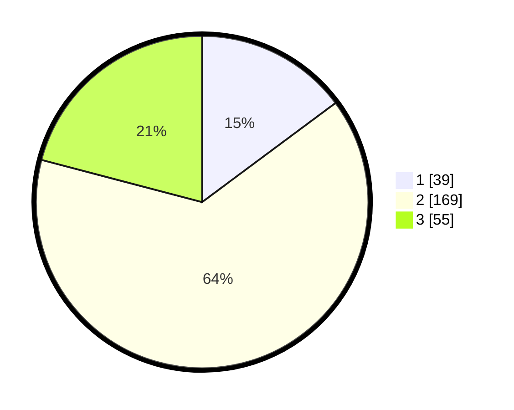

# Hasil

## Grafik

## Tabel

| No. | Nama Paslon    | Suara | Suara (raw) | Persentase |
|:--- |:-------------- | -----:| -----------:| ----------:|
| 1   | ANIES MUHAIMIN | 39    | [39][p-1]   | 14,83      |
| 2   | PRABOWO GIBRAN | 169   | [169][p-2]  | 64,26      |
| 3   | GANJAR MAHFUD  | 55    | [55][p-3]   | 20,91      |

[p-1]: https://github.com/gigit-pemilu/pemilu-2024/blob/main/pilpres/hitung-suara/sub/21-kepulauan-riau/sub/72-kota-tanjung-pinang/sub/03-tanjung-pinang-kota/sub/1003-senggarang/sub/006-tps/sub/paslon-1.txt
[p-2]: https://github.com/gigit-pemilu/pemilu-2024/blob/main/pilpres/hitung-suara/sub/21-kepulauan-riau/sub/72-kota-tanjung-pinang/sub/03-tanjung-pinang-kota/sub/1003-senggarang/sub/006-tps/sub/paslon-2.txt
[p-3]: https://github.com/gigit-pemilu/pemilu-2024/blob/main/pilpres/hitung-suara/sub/21-kepulauan-riau/sub/72-kota-tanjung-pinang/sub/03-tanjung-pinang-kota/sub/1003-senggarang/sub/006-tps/sub/paslon-3.txt

## Foto C Plano

https://sirekap-obj-formc.kpu.go.id/c757/pemilu/ppwp/21/72/03/10/03/2172031003006-20240217-112537--24e58e92-9341-4ce4-83b9-f36d4352c809.jpg

https://sirekap-obj-formc.kpu.go.id/c757/pemilu/ppwp/21/72/03/10/03/2172031003006-20240217-112711--1701cdd7-7349-485d-bcb4-ada6c597b5e8.jpg

https://sirekap-obj-formc.kpu.go.id/c757/pemilu/ppwp/21/72/03/10/03/2172031003006-20240217-112739--6fa1fe40-755c-44c8-8ae7-bdd04fab0008.jpg

## Metadata

| Key        | Value               |
| ---------- | ------------------- |
| Time Stamp | 2024-02-22 18:00:00 |

